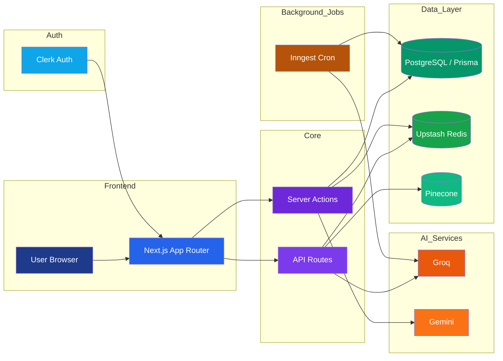
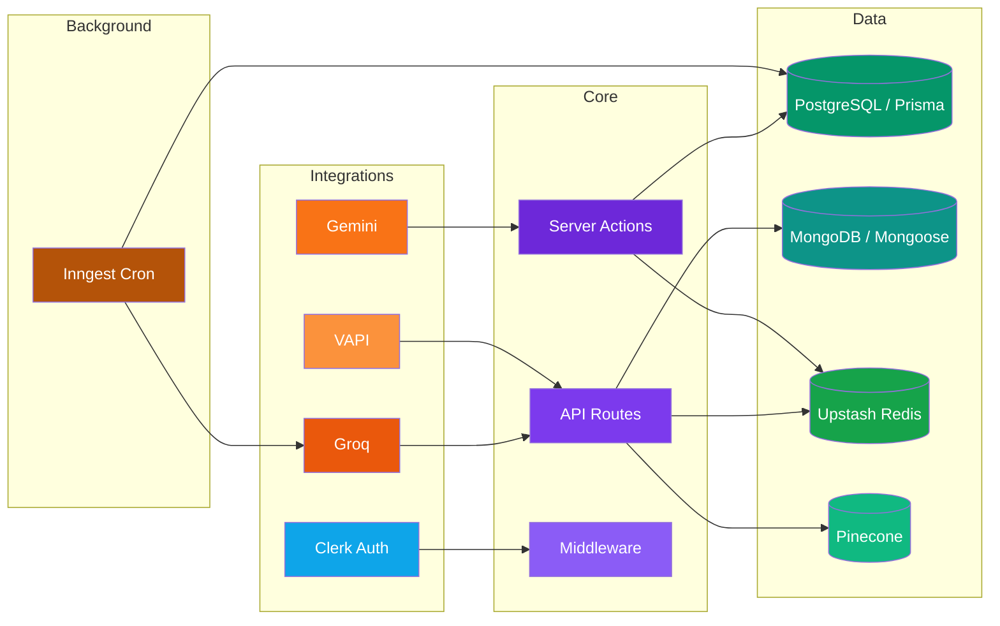
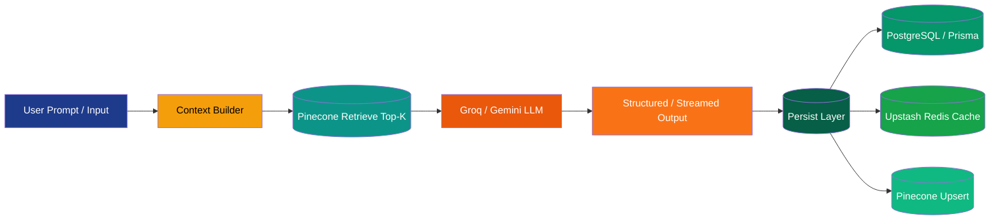
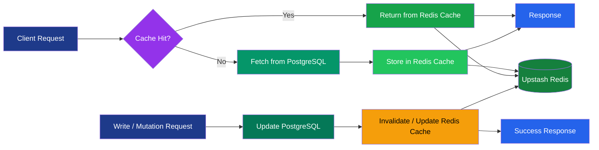

# PrepX
AI-powered interview preparation platform that unifies coaching chat, resume building, quiz assessment, industry insights, and AI learning roadmaps.

---

## 1. Project Title & Tagline

PrepX: a full-stack AI career preparation suite built as a Next.js monolith.

---

## 2. Problem Statement

Interview preparation is usually fragmented across multiple tools such as resume builders, question banks, mock interview platforms, and analytics dashboards. This leads to:

- Increased context switching
- Lack of unified progress tracking
- Weak feedback loops
- Inconsistent preparation experience

PrepX targets students and professionals preparing for technical careers by providing a single integrated platform for:

- Practice (AI quizzes)
- Improvement (AI feedback and resume enhancement)
- Direction (industry insights and learning roadmaps)

---

## 3. Solution

PrepX combines interactive frontend workflows with server actions and API routes backed by:

- PostgreSQL (NeonDB) with Prisma
- Redis for caching and session buffering
- AI services (Groq, Gemini)

At a high level:

- Users authenticate using Clerk (OAuth and email-based login)
- AI pipelines generate quizzes, roadmaps, chat responses, and resume feedback
- Redis is used for low-latency chat and caching
- All persistent data is stored in PostgreSQL via Prisma

---

## 4. Key Features

- AI career chat with streaming responses
- Redis-backed live chat session buffering
- AI resume builder with content enhancement and optimization
- Technical quiz generation, evaluation, and feedback system
- AI-generated learning roadmaps rendered as interactive graphs using React Flow
- Industry insights system with Redis caching and scheduled refresh via Inngest
- Structured AI pipelines for evaluation and content generation

---

## 5. Tech Stack

Frontend:
- Next.js (App Router)
- React
- Tailwind CSS
- Radix UI
- React Flow

Backend:
- Next.js Server Actions
- Next.js API Routes

Database:
- PostgreSQL (NeonDB)
- Prisma ORM

Caching:
- Redis (Upstash)

AI:
- Groq (Llama models)
- Google Gemini

Background Jobs:
- Inngest (cron-based workflows for insights and updates)

Authentication:
- Clerk (Google, GitHub, email/password, session management)

---

## 6. System Architecture

## High-Level System



---
## Backend Component View

## AI Processing Pipeline

## Redis Caching Layer      

## 7. Core Pipelines

Chat Pipeline:

- User sends message to chat endpoint
- Message stored in Redis session buffer
- Relevant context retrieved from cache
- AI generates streaming response
- Final response stored in PostgreSQL

---

Quiz Pipeline:

- AI generates questions dynamically based on topic
- User attempts quiz
- AI evaluates responses
- Score and feedback stored in database

---

Resume Pipeline:

- User inputs or uploads resume data
- AI enhances content (bullet points, summaries, formatting)
- Versioned resume stored in PostgreSQL

---

Insights Pipeline:

- Redis cache checked first
- If cache miss, AI generates insights
- Data stored and periodically refreshed via Inngest cron jobs

---

Roadmap Pipeline:

- AI generates structured JSON roadmap
- Stored in PostgreSQL
- Rendered using React Flow graph visualization

---

## 📁 Project Structure

```bash
ai-career-coach/
├── src/
│   ├── app/                # Next.js App Router (routes, pages, layouts)
│   ├── components/         # Reusable UI components
│   ├── actions/            # Server actions (business logic)
│   ├── hooks/              # Custom React hooks
│   ├── lib/                # Utilities (DB, AI clients, Redis, helpers)
│   ├── data/               # Static/mock data & configs
│
├── prisma/                 # Database schema & migrations
│   ├── schema.prisma
│   └── migrations/
│
├── public/                 # Static assets (images, icons)
├── scripts/                # Utility scripts (seeding, benchmarks)

├── middleware.js           # Auth & request middleware
├── next.config.mjs         # Next.js configuration
├── tailwind.config.mjs     # Tailwind CSS config
├── postcss.config.mjs      # PostCSS config
├── eslint.config.mjs       # Linting rules
├── jsconfig.json           # Path aliases & JS config

├── package.json            # Dependencies & scripts
├── package-lock.json

└── README.md
```

## 9. How the System Works

- User signs in using Clerk authentication
- User profile is created and managed in PostgreSQL via Prisma
- User accesses features like chat, quiz, resume builder, and roadmap generator
- AI requests are processed via Groq or Gemini
- Redis handles caching and live session state
- Final data is persisted in PostgreSQL
- Inngest handles scheduled background jobs for insights and updates

---

## ⚙️ Installation

```bash
# Clone the repository
git clone <your-repository-url>

# Navigate into the project
cd ai-career-coach

# Install dependencies
npm install
```

---

## 🚀 Running the Project

```bash
# Start development server
npm run dev

# Build for production
npm run build

# Start production server
npm run start
```

---

## ⏱️ Running Background Jobs (Inngest)

```bash
# Start Inngest dev server
npx inngest-cli@latest dev
```

---

## 🔐 Environment Variables

Create a `.env` file in the root directory and add:

```bash
# Database
DATABASE_URL=

# Authentication (Clerk)
CLERK_SECRET_KEY=
NEXT_PUBLIC_CLERK_PUBLISHABLE_KEY=

# OAuth Providers
GOOGLE_CLIENT_ID=
GOOGLE_CLIENT_SECRET=
GITHUB_CLIENT_ID=
GITHUB_CLIENT_SECRET=

# AI Services
GROQ_API_KEY=
GEMINI_API_KEY=

# Redis (Upstash)
UPSTASH_REDIS_REST_URL=
UPSTASH_REDIS_REST_TOKEN=

# Vector DB (optional)
PINECONE_API_KEY=

# App Config
NEXT_PUBLIC_APP_URL=
```
## 13. Performance Optimizations

- Redis cache-aside strategy for frequently accessed data
- Redis session buffering for real-time chat interactions
- Streaming AI responses to reduce perceived latency
- Prisma query optimization with indexed relational models
- Global singleton pattern for Prisma client
- Background job optimization using Inngest cron workflows

---

## 14. Performance Benchmarking & Latency Optimization

PrepX uses Redis cache-aside architecture to reduce database load and improve response times.

A benchmarking script compares:

- Cold cache (PostgreSQL query)
- Warm cache (Redis retrieval)

Measured improvements:

- Significant reduction in average response time on cached requests
- Lower p95 latency for frequently accessed endpoints
- Reduced database query overhead on repeated reads

These improvements apply to backend data retrieval and not full UI rendering time.

---

## 15. License & Ownership

Repository ownership: This project belongs to the developer.

License status: No explicit license file is currently defined.

All rights reserved unless a license is added in the repository.

Third-party services and SDKs used in this project are governed by their respective licenses.
